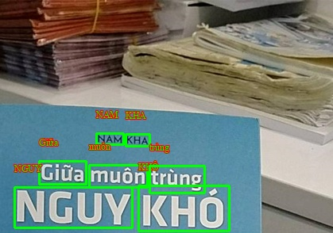

# UIT AI Challenge - Artistic Text Challenge

- [Dependencies](#dependencies)
- [Xử lý dữ liệu](#x--l--d--li-u)
  * [Đối với dữ liệu để huấn luyện cho model Recognition](#--i-v-i-d--li-u----hu-n-luy-n-cho-model-recognition)
  * [Đối với dữ liệu để huấn luyện cho model Detection](#--i-v-i-d--li-u----hu-n-luy-n-cho-model-detection)
- [Tiến hành train model](#ti-n-h-nh-train-model)
  * [Train model Detection](#train-model-detection)
  * [Train model Recognition](#train-model-recognition)
- [Lưu trained weights và convert thành Inference model](#l-u-trained-weights-v--convert-th-nh-inference-model)
  * [Đối với model Detection (YOLOv7)](#--i-v-i-model-detection--yolov7-)
  * [Đối với model Recognition (SRN)](#--i-v-i-model-recognition--srn-)
  * [Định dạng của thư mục models sau cùng](#--nh-d-ng-c-a-th--m-c-models-sau-c-ng)
- [Inference](#inference)
  * [Test model](#test-model)
  * [Xuất file để nộp](#xu-t-file----n-p)

## Dependencies
Tiến hành cài đặt các dependencies trước có thể chạy
```
pip install -r requirements.txt
```

## Xử lý dữ liệu

### Đối với dữ liệu để huấn luyện cho model Recognition

1. Đầu tiên ta tiến hành tải bộ dữ liệu đã được đánh nhãn từ BTC [tại đây](https://drive.google.com/file/u/3/d/1NJJA1A8I2Xj5-107E3DFohBNzjWyaaf7/view?usp=share_link)
2. Giải nén và thay đổi tên folder thành `data` và copy vào thư mục `tools/Recognition` với format là:
```
data
├── images 		- chứa các ảnh
├── labels 		- chứa các file json
```
3. Tiến hành chuyển tới thư mục `tools/Recognition` và thực thi câu lệnh `./process_rec.sh` để tiến hành xử lý các ảnh, sinh thêm các synthetics data, augment data và split data thành tập dữ liệu train và val (tỉ lệ 80-20)

> Team có thực hiện thêm việc kiếm tra các ảnh bị đánh nhãn sai, nên số lượng ảnh và quá trình thực hiện có khác đôi chút với hướng dẫn bên trên.

### Đối với dữ liệu để huấn luyện cho model Detection

1. Ta thực hiện tương tự như việc xử lý dữ liệu cho model `Recognition` bên trên, nhưng ta cần copy folder `data` vào thư mục `tools/Detection` 
2. Tiến hành chuyển tới thư mục `tools/Detection` và thực thi câu lệnh `./process_det.sh` để tiến hành xử lý các ảnh, augment data và split data thành tập dữ liệu train và val (tỉ lệ 80-20)  

> Và tương tự như trên, Team có thực hiện thêm việc kiếm tra các ảnh bị đánh nhãn sai, nên số lượng ảnh và quá trình thực hiện có khác đôi chút với hướng dẫn bên trên.

## Tiến hành train model

### Train model Detection
Với vấn đề này, Team sử dụng mô hình YOLOv7 được train từ đầu với dữ liệu đã được xử lý bên trên. Để tiến hành train cho model, ta lần lượt thực thi các lệnh bên trong `train_detection.ipynb`.  Trong notebook này, team có ví dụ bằng cách sử dụng [dữ liệu](https://drive.google.com/file/d/1sohRPX_oUXKt6RjwYVR0EJkBJtATmX2o/view) đã được tạo ra và được chúng mình sử dụng trong các vòng vừa qua.

### Train model Recognition
Về việc nhận diện chữ thì team chúng mình sử dụng mô hình SRN của framework PaddleOCR và tụi mình có sử dụng [pretrained model](https://paddleocr.bj.bcebos.com/dygraph_v2.0/en/rec_r50_vd_srn_train.tar) được đề cập tới trong [bài viết này](https://github.com/PaddlePaddle/PaddleOCR/blob/release/2.6/doc/doc_en/algorithm_rec_srn_en.md#1). Sau đó team mình tiến hành train dựa trên pretrained model đó với tập dữ liệu đã được team tạo ra bên trên. Để tiến hành train cho model, ta lần lượt thực thi các lệnh bên trong `train_recognition.ipynb` và cũng trong notebook này, team có ví dụ bằng cách sử dụng [dữ liệu](https://drive.google.com/file/d/1zbmLSW3t7hFq4nd1_GYHqDNHU5ggLKBB/view) đã được tạo ra và được chúng mình sử dụng trong các vòng vừa qua.

## Lưu trained weights và convert thành Inference model

### Đối với model Detection (YOLOv7)

Sau khi train xong, ta tiến hành lưu file weights vào thư mục `models/det` và đặt tên file là `yolo.pt`

### Đối với model Recognition (SRN)

- Sau khi việc train hoàn tất (hoặc không thể train thêm được nữa), ta lưu các file weights (thường là trong `output/rec/srn_new`) vào trong thư mục `models/rec/train` với tên là `ocr.pdopt`, `ocr.pdparams`, `ocr.states`.
- Sau đó tiến hành convert thành inference model bằng cách chuyển tới thư mục gốc và thực chạy lệnh:
```
./export_ocr_inference.sh
```

hoặc là

```
python3 PaddleOCR/tools/export_model.py -c PaddleOCR/configs/rec/rec_r50_fpn_srn.yml -o Global.pretrained_model=models/rec/train/ocr Global.character_dict_path=configs/dict.txt Global.save_inference_dir=models/rec/inference/
```

### Định dạng của thư mục models sau cùng
```
models
├── det
	├── yolo.pt 
└── rec
    ├── inference
		├── inference.pdiparams
		├── inference.pdiparams.info	
		├── inference.pdmodel	
    └── train
	    ├── ocr.pdopt
		├── ocr.pdparams	
		├── ocr.states	
```

## Inference

### Test model

Để tiến hành test model, ta cho các ảnh vào thư mục `data` sau đó thực hiện lệnh sau để test:

```
python predict.py --task test
```

Các kết quả sẽ được lưu vào trong thư mục `result` với những ảnh giống như thế này



### Xuất file để nộp

Tương tự như trên, ta cũng cho các ảnh cần nhận diện chữ nghệ thuật vào thư mục `data` và thực hiện lệnh sau để có được các file submit trong thư mục `result`

```
python predict.py --task submit
```
